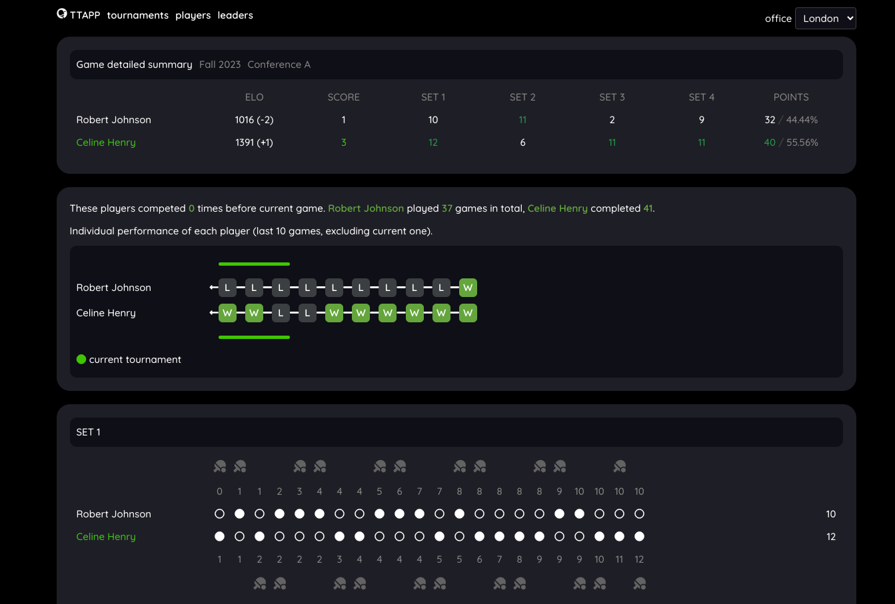

## Frontend for TTAPP (table tennis scoring app)


TTAPP (Table Tennis APP) is a web solution for hosting table tennis
tournaments with following features:

- group tournaments and playoffs tournaments
- games and tournaments statistics
- live match scout scoring using keyboard or numpad
- web sockets based spectate view of live games
- ELO registry for all participants
- support for multiple locations
- point by point view of scouted games

The TTAPP web application consists of two parts:

- frontend, current repository, (Vue3) https://github.com/office-sports/ttapp-frontend
- API, backend for web frontend (Golang + MySQL DB) https://github.com/office-sports/ttapp-api



### Prerequisites:

Running TTAPP API (see API repository for setup instructions)

### Project Setup

```sh
npm install
```

### Compile and Hot-Reload for Development

```sh
npm run dev
```

### Type-Check, Compile and Minify for Production

```sh
npm run build
```

### Lint with [ESLint](https://eslint.org/)

```sh
npm run lint
```
